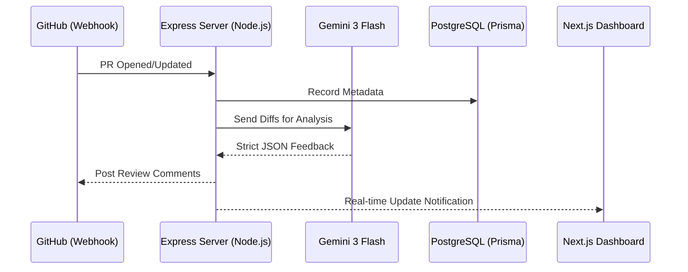

# <p align="center">🤖 ReviewAI: The Intelligent PR Sentinel</p>

<p align="center">
  
  
  
  
  
</p>

---

**ReviewAI** is a high-performance, AI-driven platform designed to act as an automated Senior Engineer on your team. It seamlessly integrates with GitHub to provide intelligent, context-aware code reviews, bug detection, and architectural feedback in real-time.

### 🌟 Why ReviewAI?
Manual code reviews are often the biggest bottleneck in modern SDLC. ReviewAI eliminates this by deploying an agentic AI reviewer that understands diffs, identifies risks, and suggests optimizations—allowing your team to ship faster without sacrificing quality.

---

## 🚀 Key Features

- **🧠 Agentic Analysis**: Powered by **Gemini 3 Flash**, ReviewAI performs deep analysis of pull request diffs, evaluating logic, performance, and security risks.
- **⚡ GitHub-Native Automation**: Real-time feedback via GitHub App webhooks. Comments are posted directly on the PR, keeping developers in their flow.
- **🎨 Premium UX/UI**: A sleek dashboard built with **Next.js 16 (React 19)** and **Tailwind CSS 4**, featuring fluid hardware-accelerated animations using **GSAP** and **Motion**.
- **🛡️ Enterprise Grade Auth**: Secure, multi-provider authentication (GitHub, Google) powered by **Better Auth**.
- **📊 Workspace Management**: Track multiple repositories and review history through a centralized, high-fidelity dashboard.

---

## 🏗️ Technical Architecture

ReviewAI is built with a decoupled modern architecture, ensuring high scalability and maintainability.

### System Design


### Core Components
| Directory | Responsibility | Tech Stack |
|-----------|----------------|------------|
| [`frontend`](./frontend) | Premium Dashboard UI & Onboarding | Next.js 16, React 19, Better Auth, GSAP, Motion, Zustand, Tailwind 4 |
| [`backend`](./backend) | AI Pipeline, Webhook logic, API | Express 5, Prisma, Gemini 3 Flash, Octokit, Better Auth |

---

## 💎 Engineering Excellence

- **Gemini 3 Flash Pipeline**: Implemented a robust AI communication layer that enforces strict JSON schemas for 100% predictable feedback.
- **Modern React primitives**: Utilizing React 19's latest features for optimal performance and cleaner state management.
- **Type-Safe Fullstack**: Extensive use of TypeScript across both services ensures runtime reliability and developer productivity.
- **Motion Orchestration**: Complex UI transitions orchestrated via GSAP and Motion for a truly premium feel.

---

## 🛠️ Getting Started

### Prerequisites
- **Node.js** 20.x+
- **pnpm** 10.x+
- **PostgreSQL** instance

### 1. Installation
Clone the repository and install dependencies in both project roots:

```bash
# Clone the repo
git clone https://github.com/akdevsaha-dev/ReviewAI.git
cd ReviewAI

# Install Frontend dependencies
cd frontend && pnpm install

# Install Backend dependencies
cd ../backend && pnpm install
```

### 2. Environment Configuration
Create `.env` files in both `frontend` and `backend` directories based on their respective `.env.example` files.

**Backend Required Keys:**
- `GEMINI_API_KEY`
- `GITHUB_APP_PRIVATE_KEY`
- `GITHUB_APP_ID`
- `DATABASE_URL`
- `BETTER_AUTH_SECRET`

### 3. Database Initialization
```bash
cd backend
pnpm db:migrate
pnpm db:generate
```

### 4. Running the Project
Use two terminal instances to run both services:

```bash
# Terminal 1: Frontend
cd frontend
pnpm dev

# Terminal 2: Backend
cd backend
pnpm dev
```

- **Dashboard**: `http://localhost:3000` (or as configured)
- **API**: `http://localhost:5000` (or as configured)

---

## 🗺️ Vision & Roadmap

- [ ] **Multi-Agent Reviewers**: Specialized AI personas for Security, Performance, and Accessibility.
- [ ] **Automated Fix Suggestions**: One-click "Apply Fix" directly from the dashboard.
- [ ] **Integrations**: Slack and Discord notifications for critical risk alerts.
- [ ] **Self-Hosting**: Dockerized distribution for enterprise-grade private deployments.

---

## 📄 License
This project is licensed under the **MIT License** — see the [LICENSE](./LICENSE) file for details.

---
<p align="center">Built with 💙 by the ReviewAI Team</p>
